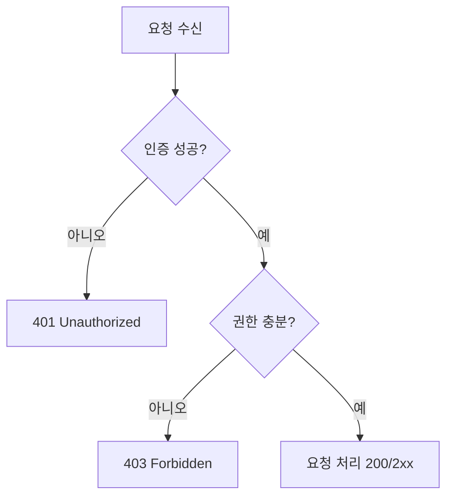
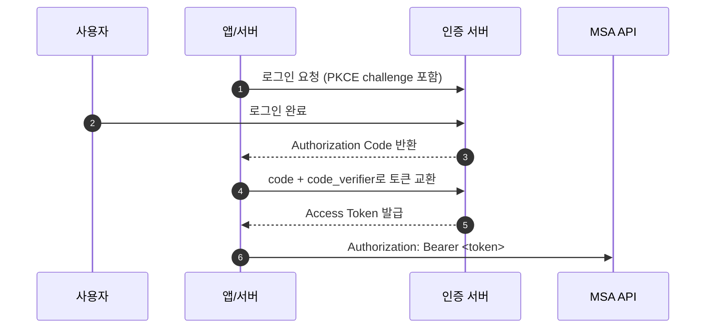

# 인증 기초 가이드 (초심자용)

이 문서는 인증/인가를 처음 접하는 개발자가 산돌이 인증 문서를 읽기 전에 알아야 할 핵심 개념을 설명한다.

## 공통 규약(필수)

현재/도입 예정 구분:

- 현재: Gateway 라우팅 + `X-User-ID` 중심 운영
- 도입 예정: `Authorization` 헤더 및 JWKS 기반 MSA 직접 검증

- 현재 MSA 인증은 Gateway 라우팅 + `X-User-ID` 전달 규약을 기준으로 운영한다.
- `X-User-ID`는 내부 사용자 컨텍스트 전달용 표준 헤더다.
- `Authorization`/JWKS 기반 MSA 직접 검증은 도입 예정 항목이다.
- `401`은 인증 실패(헤더 누락, 토큰 무효/만료, `sub` 불일치), `403`은 인증 성공 후 권한 부족에만 사용한다.
- Relay 콜백 수락 조건은 서명(HMAC), timestamp, nonce 3가지 모두 통과다.

## 1) 인증과 인가의 차이

- 인증(Authentication): "이 요청이 누구인지" 확인
- 인가(Authorization): "이 사용자가 이 작업을 해도 되는지" 확인

실무에서는 보통 다음 순서로 처리한다.

1. 인증 실패 -> `401 Unauthorized`
2. 인증 성공, 권한 부족 -> `403 Forbidden`

## 2) 왜 토큰을 쓰는가

세션 쿠키 대신 JWT 기반 토큰을 사용하면 MSA 환경에서 서비스 간 확장이 쉽다.

- 클라이언트는 요청할 때 `Authorization: Bearer <token>`을 보냄
- 서비스는 토큰 서명/클레임을 검증한 뒤 요청을 처리
- 위 패턴은 일반적인 OAuth/OIDC 구조이며, 산돌이의 현재 MSA 간 표준은 `X-User-ID` 중심으로 운영 중이다.

## 3) Access Token과 Refresh Token

- Access Token: 짧은 수명, API 호출용
- Refresh Token: Access Token 재발급용
- `offline_access`: 사용자가 앱을 닫아도 갱신 가능한 권한(민감도 높음)

## 4) OIDC Authorization Code + PKCE 흐름

간단히 말하면 아래와 같다.

1. 앱/서버가 로그인 페이지로 보냄
2. 사용자가 로그인 성공
3. 인증 서버가 "Authorization Code"를 돌려줌
4. 서버가 이 code를 토큰으로 교환
5. 이후 API는 Access Token으로 호출

PKCE가 필요한 이유:

- 코드 탈취 공격 완화
- `code_verifier`를 가진 주체만 최종 토큰 교환 가능

## 5) JWKS 검증이란 무엇인가 (도입 예정)

JWT는 서명이 붙어 있으므로, 서비스는 공개키로 이 서명을 검증해야 한다.

- 공개키 목록이 JWKS
- 토큰 header의 `kid`로 JWKS 키를 선택
- 서명 + `iss` + `aud` + 시간 클레임을 함께 검증
- 산돌이 프로젝트에서는 현재 MSA 간 직접 검증에 적용하지 않았고, 전환 시 적용할 기준으로 유지한다.

## 6) 산돌이 프로젝트에서의 핵심 규칙

- 현재 MSA 호출의 표준 헤더는 `X-User-ID`
- `Authorization` 헤더 및 `X-User-ID = sub` 강제 검증은 도입 예정
- Gateway 경계 인증 검증은 현재 미적용
- 각 MSA의 JWKS 기반 검증은 도입 예정

## 7) 가장 흔한 실수

- `X-User-ID` 문자열만 믿고 토큰 검증 생략
- `verify_signature=False`로 운영 코드 작성
- `iss`/`aud` 체크 누락
- refresh token을 로그에 출력하거나 평문 저장

## 8) 다음 문서 읽기 순서

1. `docs/glossary.md`
2. `docs/auth-chatbot-auth-relay.md`
3. `docs/auth-msa-communication.md`
4. `docs/jwks-common-module-guideline.md`
5. `docs/jwks-validation-checklist.md`

## 참고 문헌

- Keycloak OIDC: https://www.keycloak.org/securing-apps/oidc-layers
- OIDC Core 1.0: https://openid.net/specs/openid-connect-core-1_0.html
- OIDC Discovery 1.0: https://openid.net/specs/openid-connect-discovery-1_0.html
- RFC 7636 (PKCE): https://www.rfc-editor.org/rfc/rfc7636.html
- RFC 8252 (OAuth for Native Apps): https://www.rfc-editor.org/rfc/rfc8252.html
- RFC 8725 (JWT BCP): https://www.rfc-editor.org/rfc/rfc8725.html
- RFC 9068 (JWT Access Token Profile): https://www.rfc-editor.org/rfc/rfc9068.html
