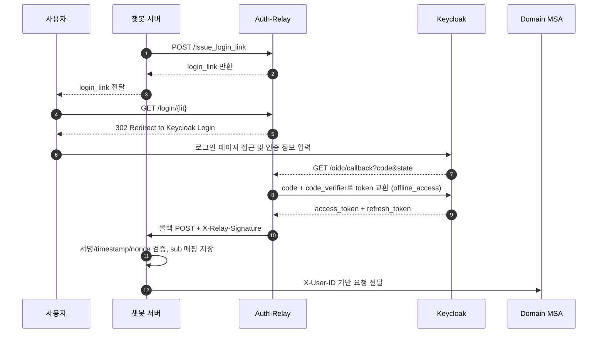
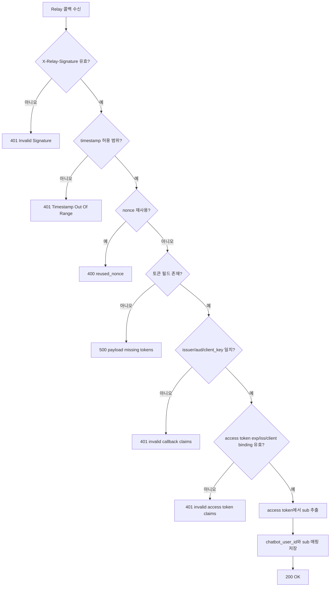
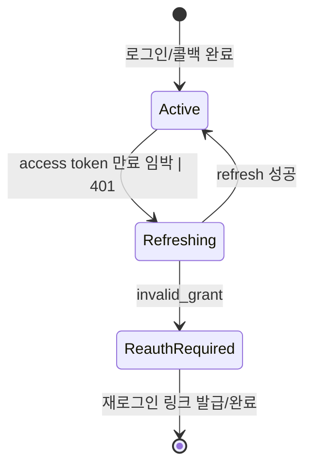

# 챗봇(Auth-Relay) 인증 및 offline_access 저장

## 목적

여러 챗봇 서버(예: discord-bot, telegram-bot 등)가 Auth-Relay를 통해 사용자 인증을 완료하고, [offline_access](./glossary.md#offline_access) 기반 갱신 체계를 안정적으로 운영하기 위한 상세 규칙을 정의한다.

관련 용어: [Authorization Code Flow](./glossary.md#authorization-code-flow), [PKCE](./glossary.md#pkce), [Refresh Token](./glossary.md#refresh-token), [sub](./glossary.md#sub), [X-User-ID](./glossary.md#x-user-id)

이 문서는 아래 두 파트로 분리된다.

- 인증 구조 이해 파트: 전체 흐름과 단계별 동작을 이해하는 목적
- 개발 가이드 파트: API 계약, 운영 규칙, 코드베이스 적용 근거를 확인하는 목적

<a id="auth-relay-understanding"></a>
## 인증 구조 이해 파트

이 파트는 인증 흐름과 경계를 이해하는 목적이며, 엔드포인트별 성공/실패 코드 목록은 다루지 않는다.

## 전체 흐름 요약

1. 봇 서버가 Auth-Relay에 로그인 링크 발급 요청
2. 사용자는 로그인 링크를 열고 Keycloak 로그인
3. Auth-Relay가 인가 코드를 토큰으로 교환 (`scope=openid offline_access`)
4. Auth-Relay가 봇 콜백으로 토큰 전달 (`X-Relay-Signature` 포함)
5. 봇 서버가 서명/timestamp/nonce를 검증하고 사용자 매핑 저장
6. 봇 서버는 이후 MSA 호출 시 `X-User-ID` 기반 사용자 컨텍스트로 호출

용어 규약:

- `챗봇 서버`: 플랫폼별 챗봇 백엔드(discord-bot/telegram-bot 등)
- `chatbot_user_id`: 플랫폼 내부 사용자 식별자



## 단계별 상세 설명

### 1) 로그인 링크 발급

- 호출 주체: 챗봇 서버
- 대상 API: Auth-Relay `POST /issue_login_link`
- 목적: 사용자가 열 수 있는 1회성 로그인 시작 URL(LIT) 발급

요청 예시:

```json
{
  "chatbot_user_id": "chatbot-user-123",
  "callback_url": "https://sandol.example.com/chatbot-service/users/callback",
  "client_key": "sandol-chatbot-service",
  "redirect_after": "/login/success"
}
```

응답 예시:

```json
{
  "login_link": "https://sandol.example.com/relay/login/<lit>",
  "expires_in": 600
}
```

필드 설명:

| 필드 | 타입 | 필수 | 설명 |
|---|---|---|---|
| `chatbot_user_id` | string | O | 플랫폼 내부 사용자 식별자 |
| `callback_url` | URL | O | Relay가 토큰을 POST할 봇 서버 콜백 URL. `client_key`별 `callback_url_allowlist`와 절대 URL exact match여야 한다. |
| `client_key` | string | O | Auth-Relay에 등록된 클라이언트 키 |
| `redirect_after` | string | X | 로그인 완료 후 브라우저 최종 이동 경로. 안전한 상대경로만 허용되며 `redirect_after_allowlist` prefix 정책을 따른다. |

정책 요약:

- `callback_url`은 Relay가 토큰을 전달할 서버간 콜백 목적지이며, 절대 URL exact match allowlist로 검증한다.
- `redirect_after`는 사용자 브라우저 최종 이동 경로이며, 외부 URL이 아닌 상대경로 allowlist로 검증한다.

### 2) 사용자 로그인 시작

- 사용자 브라우저가 `GET /login/{lit}` 접근
- Relay는 LIT를 검증하고 Keycloak 인가 URL로 `302` 리다이렉트
- 내부적으로 `state`, `nonce`, `code_verifier` 생성 후 세션 저장

### 3) OIDC 콜백 처리

- Keycloak이 `GET /oidc/callback?code=...&state=...` 호출
- Relay는 `state`를 검증하고 code를 token으로 교환
- `refresh_token`이 없으면 `no_offline_refresh_token` 오류로 실패 처리

Relay -> Bot 콜백 payload 예시:

```json
{
  "issuer": "https://sandol.example.com/auth/realms/Sandori",
  "aud": "sandol-chatbot-service",
  "chatbot_user_id": "chatbot-user-123",
  "client_key": "sandol-chatbot-service",
  "relay_access_token": "<access_token>",
  "offline_refresh_token": "<refresh_token>",
  "expires_in": 300,
  "refresh_expires_in": 0,
  "ts": 1700000000,
  "nonce": "random-string"
}
```

요청 헤더:

| 헤더 | 필수 | 설명 |
|---|---|---|
| `X-Relay-Signature` | O | payload 정규화 JSON에 대한 HMAC-SHA256(base64url) |

서명 검증 계약(공유 시크릿):

- Auth-Relay와 Chatbot은 동일한 HMAC 공유 시크릿 값을 사용한다.
- 환경 변수 이름은 서로 다를 수 있다.
  - Relay: `RELAY_TO_CHATBOT_HMAC_SECRET`
  - Chatbot: `RELAY_CLIENT_SECRETS`
- Relay는 콜백 payload를 canonical JSON(UTF-8)으로 직렬화한 뒤 HMAC-SHA256을 계산한다.
- 계산 결과는 base64url(패딩 없음)로 인코딩해 `X-Relay-Signature` 헤더에 담아 전송한다.
- Chatbot은 동일한 방식으로 서명을 재계산하고, 상수 시간 비교(constant-time compare)로 헤더 값과 비교해야 한다.
- 불일치 시 즉시 `401 Invalid X-Relay-Signature`를 반환하고 payload를 신뢰하지 않는다.
- 참고: `X-Relay-Signature`는 암호화가 아니라 무결성/송신자 검증을 위한 HMAC 서명이다.

왜 상수 시간 비교가 필요한가:

- 일반 문자열 비교(`==`)는 불일치 지점에서 비교를 빨리 끝내는 경우가 있어, 응답 시간 차이로 서명값을 추측하는 타이밍 공격에 취약할 수 있다.
- 상수 시간 비교는 값이 언제 틀리든 동일한 비교 경로를 사용해 시간 기반 정보 누출을 줄인다.
- 따라서 서명 검증에서는 "비교 함수 선택"이 보안 요구사항이며, 구현 세부가 아니다.

구현 원칙(중요):

- 가능하면 프로젝트의 검증 함수를 재사용한다.
  - 예시(kakao-bot): `sandol_kakao_bot_service/app/services/auth_service.py`의 `verify_relay_signature`
- 새로 구현할 때는 직접 비교 로직을 만들지 말고, 언어 표준/검증된 모듈 함수를 사용한다.
- 금지: `expected_sig == provided_sig` 같은 일반 문자열 비교.

언어별 권장 함수:

| 언어 | 권장 함수 | 비고 |
|---|---|---|
| Python | `hmac.compare_digest` | 현재 챗봇 서비스 예시 구현이 사용하는 방식 |
| Node.js | `crypto.timingSafeEqual` | 버퍼 길이 확인 후 비교 |

공식 참고 문헌:

- Python `hmac.compare_digest`: https://docs.python.org/3/library/hmac.html#hmac.compare_digest
- Python HMAC 검증 시 `==` 대신 `compare_digest` 권고: https://docs.python.org/3/library/hmac.html#hmac.HMAC.digest
- Node.js `crypto.timingSafeEqual`: https://nodejs.org/api/crypto.html#cryptotimingsafeequala-b
- 타이밍 정보 노출 약점(CWE-208): https://cwe.mitre.org/data/definitions/208.html

검증 절차(권장 구현):

1. 요청 헤더에서 `X-Relay-Signature`를 읽는다(없으면 즉시 401).
2. Relay와 동일한 canonical JSON 직렬화 규칙으로 payload 바이트를 만든다.
3. 챗봇 서버 설정의 공유 시크릿 값(`RELAY_CLIENT_SECRETS`)으로 HMAC-SHA256 digest를 계산한다.
4. digest를 base64url(패딩 없음)로 인코딩해 기대 서명값(`expected_sig`)을 만든다.
5. `expected_sig`와 헤더 서명값(`provided_sig`)을 상수 시간 비교로 검증한다.
6. 비교 실패 시 즉시 401 반환 후 요청 처리를 중단한다.

언어 독립 의사코드:

```text
provided_sig = header["X-Relay-Signature"]
if provided_sig is missing:
  return 401

canonical = canonical_json(payload)   # sort_keys, compact separators, UTF-8
digest = HMAC_SHA256(shared_secret, canonical)
expected_sig = BASE64URL_NOPAD(digest)

if CONSTANT_TIME_COMPARE(expected_sig, provided_sig) is false:
  return 401

continue to timestamp/nonce verification
```

JavaScript 예시(Node.js):

```javascript
import crypto from 'crypto';

function canonicalJson(payload) {
  const ordered = Object.keys(payload)
    .sort()
    .reduce((acc, key) => {
      acc[key] = payload[key];
      return acc;
    }, {});
  return JSON.stringify(ordered);
}

function base64urlNoPad(buf) {
  return buf
    .toString('base64')
    .replace(/\+/g, '-')
    .replace(/\//g, '_')
    .replace(/=+$/g, '');
}

export function verifyRelaySignature(payload, providedSig, sharedSecret) {
  if (!providedSig) return false;

  const msg = Buffer.from(canonicalJson(payload), 'utf8');
  const mac = crypto.createHmac('sha256', sharedSecret).update(msg).digest();
  const expectedSig = base64urlNoPad(mac);

  const expectedBuf = Buffer.from(expectedSig, 'utf8');
  const providedBuf = Buffer.from(providedSig, 'utf8');
  if (expectedBuf.length !== providedBuf.length) return false;

  return crypto.timingSafeEqual(expectedBuf, providedBuf);
}
```

Python 예시가 필요하면(kakao-bot 구현 기준) `sandol_kakao_bot_service/app/services/auth_service.py`의 `verify_relay_signature` 구현을 참고한다.

주의사항:

- `expected_sig == provided_sig` 같은 일반 문자열 비교를 사용하지 않는다.
- Relay/Chatbot의 canonical JSON 규칙이 다르면 정상 요청도 검증 실패한다.
- base64url 패딩(`=`) 처리는 하지 않는것으로(있다면, 제거하는 것으로) 통일한다.

### 4) 봇 서버 콜백 처리 (`POST /users/callback`)

- 입력: `LoginCallbackReq` + `X-Relay-Signature`
- 검증 순서:
  1) 서명 검증
  2) timestamp 검증
  3) nonce 재사용 검증
  4) 토큰 필드 존재 검증
  5) callback payload의 `issuer/aud/client_key` 검증
  6) access token의 `exp/iss`와 client binding 검증 후 `sub` 추출
  7) `chatbot_user_id`와 `sub` 매핑 저장



성공 응답 예시:

```json
{
  "status": "ok",
  "message": "Callback processed successfully",
  "user_map_id": 123
}
```

실패 응답 예시:

```json
{
  "error": "Invalid X-Relay-Signature header"
}
```

구현 적용이 목적이면 [개발 가이드 파트](#auth-relay-dev-guide)로 이동한다.

<a id="auth-relay-dev-guide"></a>
## 개발 가이드 파트

이 파트는 API 계약과 운영 적용 규칙이 목적이며, 인증 개념의 기초 설명은 다루지 않는다.

## API 계약 상세

### A. Auth-Relay: `POST /issue_login_link`

성공 코드:

- `200 OK`: `IssueLinkRes`

대표 실패:

- `400 redirect_after_not_allowed`
- `400 unknown_client_key` (클라이언트 설정 미존재)

### B. Auth-Relay: `GET /login/{lit}`

성공 코드:

- `302 Found`: Keycloak authorization endpoint

대표 실패:

- `400 invalid_or_expired_link`
- `400 missing_required_claims`

### C. Auth-Relay: `GET /oidc/callback`

입력 query:

| 이름 | 필수 | 설명 |
|---|---|---|
| `code` | O | Authorization Code |
| `state` | O | state 검증 값 |

성공 코드:

- `302 Found`: `redirect_after` 또는 `/`

대표 실패:

- `400 invalid_or_expired_state`
- `502 token_exchange_failed`
- `502 no_access_token`
- `502 no_offline_refresh_token`
- `502 callback_timeout`
- `502 callback_invalid_status`
- `502 callback_request_error`

### D. 챗봇 서버: `POST /users/callback`

필수 헤더:

- `X-Relay-Signature`

요청 바디:

- `LoginCallbackReq` 스키마 (위 payload 예시 참고)

`LoginCallbackReq` 필드:

| 필드 | 타입 | 필수 | 설명 |
|---|---|---|---|
| `issuer` | string | O | Keycloak issuer URL |
| `aud` | string | O | Relay callback payload의 대상 챗봇 서비스 audience |
| `chatbot_user_id` | string | O | 플랫폼 사용자 식별자 |
| `client_key` | string | O | Auth-Relay에 등록된 챗봇 클라이언트 키 |
| `relay_access_token` | string | O | Relay가 전달하는 access token |
| `offline_refresh_token` | string | O | Relay가 전달하는 refresh token |
| `expires_in` | int | O | access token 만료까지 남은 초 |
| `refresh_expires_in` | int | O | refresh token 만료까지 남은 초(무기한이면 0) |
| `ts` | int | O | 콜백 생성 시각(epoch seconds) |
| `nonce` | string | O | 1회용 재사용 방지 식별자 |

성공 코드:

- `200 OK`

대표 실패:

- `401 Missing X-Relay-Signature header`
- `401 Invalid X-Relay-Signature header`
- `401 Timestamp is out of acceptable range`
- `400 reused_nonce`
- `401 invalid_callback_issuer`
- `401 invalid_callback_audience`
- `401 invalid_callback_client_key`
- `401 invalid_access_token_audience`
- `401 invalid_access_token_issuer`
- `401 expired_access_token`
- `500 Login callback payload is missing required tokens...`

## 운영 정책

### Relay -> Bot 콜백 보안

- `X-Relay-Signature` HMAC 검증 필수
- timestamp 허용 오차 초과 시 거부
- nonce 재사용 시 거부 ([Replay Attack](./glossary.md#replay-attack))
- callback payload의 `issuer/aud/client_key`가 현재 챗봇 설정과 일치해야 한다.
- access token의 client binding은 `azp`를 우선 사용하고, `azp`가 없을 때만 `aud`를 fallback으로 사용한다.
- 위 3가지 조건을 하나라도 만족하지 못하면 콜백을 수락하지 않고 인증 실패로 처리한다.

### Relay allowlist 정책

- `callback_url_allowlist`: Relay가 토큰을 POST할 목적지 검증용 absolute URL exact match 정책
- `redirect_after_allowlist`: 사용자 브라우저 최종 이동용 safe relative path prefix 정책
- `redirect_after`가 허용되지 않으면 Relay는 최종 목적지를 `/`로 fallback한다.

### 토큰 저장/갱신 정책

- Access/Refresh Token 모두 암호화 저장
- 만료 시각은 UTC 기준 저장
- Refresh 실패(`invalid_grant`) 시 저장된 access/refresh token과 만료시각을 정리한 뒤 사용자 재로그인 유도
- 새 refresh token이 발급되면 즉시 교체 저장



### MSA 호출 시 헤더 규칙

- 현재: MSA로 나가는 요청은 `X-User-ID`를 사용한다.
- 현재: `X-User-ID` 값은 내부 사용자 컨텍스트 식별자로 사용한다.
- 도입 예정: `Authorization` 헤더 기반 MSA 인증/JWKS 직접 검증을 적용한다.
- Auth-Relay 내부 인증 경계에서는 Keycloak `sub`를 사용할 수 있다.

## 코드베이스 근거 (현재)

- Auth-Relay 엔드포인트: `sandol-auth-relay/app/routers/auth.py`
- Auth-Relay 스키마: `sandol-auth-relay/app/schemas/auth.py`
- 챗봇 서버 콜백 엔드포인트 예시(kakao-bot): `sandol_kakao_bot_service/app/routers/user.py`
- 챗봇 서버 콜백 스키마/검증 로직 예시(kakao-bot): `sandol_kakao_bot_service/app/schemas/auth.py`, `sandol_kakao_bot_service/app/services/auth_service.py`

인증 구조 요약을 다시 보려면 [인증 구조 이해 파트](#auth-relay-understanding)로 이동한다.
