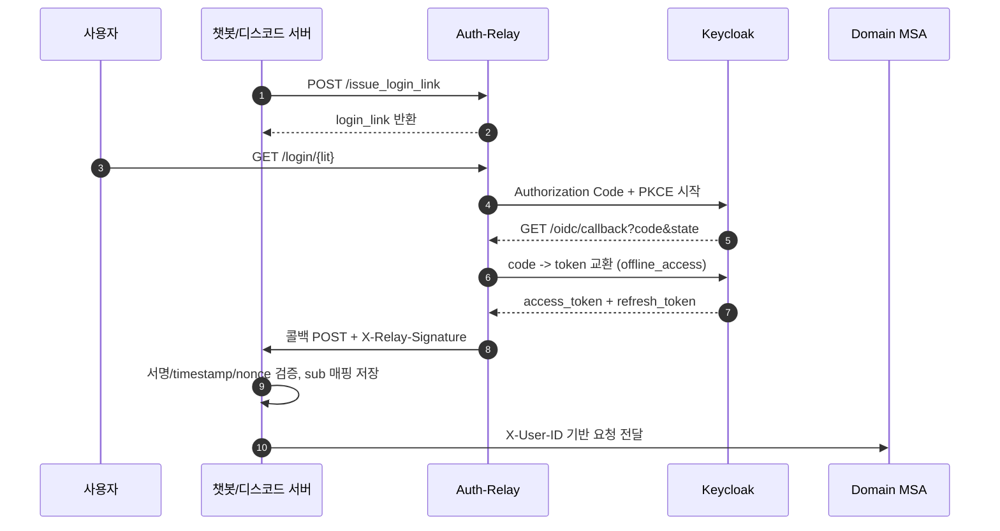
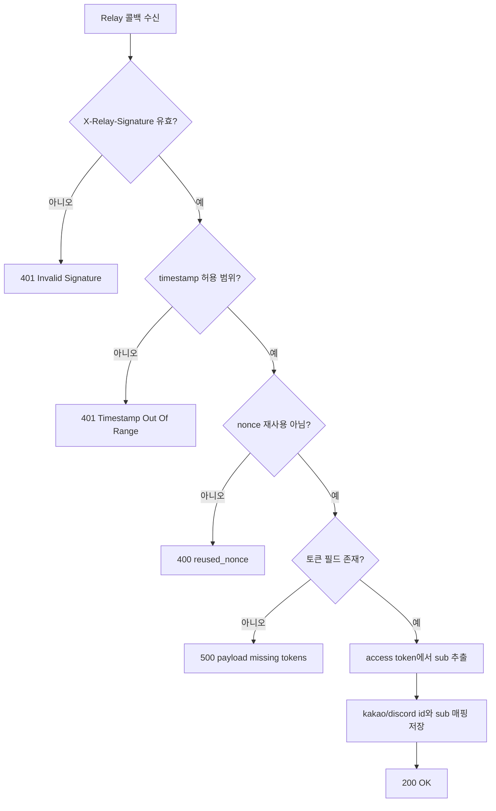

# 챗봇/디스코드 Auth-Relay 인증 및 offline_access 저장

## 목적

카카오톡 챗봇/디스코드 봇 서버가 Auth-Relay를 통해 사용자 인증을 완료하고, [offline_access](./glossary.md#offline_access) 기반 갱신 체계를 안정적으로 운영하기 위한 상세 규칙을 정의한다.

관련 용어: [Authorization Code Flow](./glossary.md#authorization-code-flow), [PKCE](./glossary.md#pkce), [Refresh Token](./glossary.md#refresh-token), [sub](./glossary.md#sub), [X-User-ID](./glossary.md#x-user-id)

이 문서는 아래 두 파트로 분리된다.

- 인증 구조 이해 파트: 전체 흐름과 단계별 동작을 이해하는 목적
- 개발 가이드 파트: API 계약, 운영 규칙, 코드베이스 적용 근거를 확인하는 목적

<a id="auth-relay-understanding"></a>
## 인증 구조 이해 파트

이 파트는 인증 흐름과 경계를 이해하는 목적이며, 엔드포인트별 성공/실패 코드 목록은 다루지 않는다.

## 전체 흐름 요약

1. 봇 서버가 Auth-Relay에 로그인 링크 발급 요청
2. 사용자는 로그인 링크를 열고 Keycloak 로그인
3. Auth-Relay가 인가 코드를 토큰으로 교환 (`scope=openid offline_access`)
4. Auth-Relay가 봇 콜백으로 토큰 전달 (`X-Relay-Signature` 포함)
5. 봇 서버가 서명/timestamp/nonce를 검증하고 사용자 매핑 저장
6. 봇 서버는 이후 MSA 호출 시 `X-User-ID` 기반 사용자 컨텍스트로 호출



## 단계별 상세 설명

### 1) 로그인 링크 발급

- 호출 주체: 챗봇/디스코드 서버
- 대상 API: Auth-Relay `POST /issue_login_link`
- 목적: 사용자가 열 수 있는 1회성 로그인 시작 URL(LIT) 발급

요청 예시:

```json
{
  "chatbot_user_id": "kakao-user-123",
  "callback_url": "https://sandol.example.com/kakao-bot/users/callback",
  "client_key": "sandol-kakao-bot",
  "redirect_after": "https://sandol.example.com/login/success"
}
```

응답 예시:

```json
{
  "login_link": "https://sandol.example.com/relay/login/<lit>",
  "expires_in": 600
}
```

필드 설명:

| 필드 | 타입 | 필수 | 설명 |
|---|---|---|---|
| `chatbot_user_id` | string | O | 챗봇 내부 사용자 식별자 |
| `callback_url` | URL | O | Relay가 토큰을 POST할 봇 서버 콜백 URL |
| `client_key` | string | O | Auth-Relay에 등록된 클라이언트 키 |
| `redirect_after` | URL | X | 로그인 완료 후 브라우저 최종 이동 URL |

### 2) 사용자 로그인 시작

- 사용자 브라우저가 `GET /login/{lit}` 접근
- Relay는 LIT를 검증하고 Keycloak 인가 URL로 `302` 리다이렉트
- 내부적으로 `state`, `nonce`, `code_verifier` 생성 후 세션 저장

### 3) OIDC 콜백 처리

- Keycloak이 `GET /oidc/callback?code=...&state=...` 호출
- Relay는 `state`를 검증하고 code를 token으로 교환
- `refresh_token`이 없으면 `no_offline_refresh_token` 오류로 실패 처리

Relay -> Bot 콜백 payload 예시:

```json
{
  "issuer": "https://sandol.example.com/auth/realms/Sandori",
  "aud": "sandol-kakao-bot",
  "chatbot_user_id": "kakao-user-123",
  "client_key": "sandol-kakao-bot",
  "relay_access_token": "<access_token>",
  "offline_refresh_token": "<refresh_token>",
  "expires_in": 300,
  "refresh_expires_in": 0,
  "ts": 1700000000,
  "nonce": "random-string"
}
```

요청 헤더:

| 헤더 | 필수 | 설명 |
|---|---|---|
| `X-Relay-Signature` | O | payload 정규화 JSON에 대한 HMAC-SHA256(base64url) |

### 4) 봇 서버 콜백 처리 (`POST /users/callback`)

- 입력: `LoginCallbackReq` + `X-Relay-Signature`
- 검증 순서:
  1) 서명 검증
  2) timestamp 검증
  3) nonce 재사용 검증
  4) 토큰 필드 존재 검증
  5) access token에서 `sub` 추출
  6) `kakao_id/discord_id`와 `sub` 매핑 저장



성공 응답 예시:

```json
{
  "status": "ok",
  "message": "Callback processed successfully",
  "user_map_id": 123
}
```

실패 응답 예시:

```json
{
  "error": "Invalid X-Relay-Signature header"
}
```

구현 적용이 목적이면 [개발 가이드 파트](#auth-relay-dev-guide)로 이동한다.

<a id="auth-relay-dev-guide"></a>
## 개발 가이드 파트

이 파트는 API 계약과 운영 적용 규칙이 목적이며, 인증 개념의 기초 설명은 다루지 않는다.

## API 계약 상세

### A. Auth-Relay: `POST /issue_login_link`

성공 코드:

- `200 OK`: `IssueLinkRes`

대표 실패:

- `400 redirect_after_not_allowed`
- `400 unknown_client_key` (클라이언트 설정 미존재)

### B. Auth-Relay: `GET /login/{lit}`

성공 코드:

- `302 Found`: Keycloak authorization endpoint

대표 실패:

- `400 invalid_or_expired_link`
- `400 missing_required_claims`

### C. Auth-Relay: `GET /oidc/callback`

입력 query:

| 이름 | 필수 | 설명 |
|---|---|---|
| `code` | O | Authorization Code |
| `state` | O | state 검증 값 |

성공 코드:

- `302 Found`: `redirect_after` 또는 `/`

대표 실패:

- `400 invalid_or_expired_state`
- `502 token_exchange_failed`
- `502 no_access_token`
- `502 no_offline_refresh_token`
- `502 callback_timeout`
- `502 callback_invalid_status`
- `502 callback_request_error`

### D. 챗봇 서버: `POST /users/callback`

필수 헤더:

- `X-Relay-Signature`

요청 바디:

- `LoginCallbackReq` 스키마 (위 payload 예시 참고)

성공 코드:

- `200 OK`

대표 실패:

- `401 Missing X-Relay-Signature header`
- `401 Invalid X-Relay-Signature header`
- `401 Timestamp is out of acceptable range`
- `400 reused_nonce`
- `500 Login callback payload is missing required tokens...`

## 운영 정책

### Relay -> Bot 콜백 보안

- `X-Relay-Signature` HMAC 검증 필수
- timestamp 허용 오차 초과 시 거부
- nonce 재사용 시 거부 ([Replay Attack](./glossary.md#replay-attack))
- 위 3가지 조건을 하나라도 만족하지 못하면 콜백을 수락하지 않고 인증 실패로 처리한다.

### 토큰 저장/갱신 정책

- Access/Refresh Token 모두 암호화 저장
- 만료 시각은 UTC 기준 저장
- Refresh 실패(`invalid_grant`) 시 사용자 재로그인 유도
- 새 refresh token이 발급되면 즉시 교체 저장


### MSA 호출 시 헤더 규칙

- 현재: MSA로 나가는 요청은 `X-User-ID`를 사용한다.
- 현재: `X-User-ID` 값은 내부 사용자 컨텍스트 식별자로 사용한다.
- 도입 예정: `Authorization` 헤더 기반 MSA 인증/JWKS 직접 검증을 적용한다.
- Auth-Relay 내부 인증 경계에서는 Keycloak `sub`를 사용할 수 있다.

## 코드베이스 근거 (현재)

- Auth-Relay 엔드포인트: `sandol-auth-relay/app/routers/auth.py`
- Auth-Relay 스키마: `sandol-auth-relay/app/schemas/auth.py`
- 챗봇 콜백 엔드포인트: `sandol_kakao_bot_service/app/routers/user.py`
- 챗봇 콜백 스키마/검증 로직: `sandol_kakao_bot_service/app/schemas/auth.py`, `sandol_kakao_bot_service/app/services/auth_service.py`

인증 구조 요약을 다시 보려면 [인증 구조 이해 파트](#auth-relay-understanding)로 이동한다.
