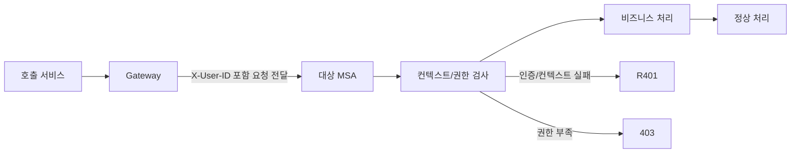
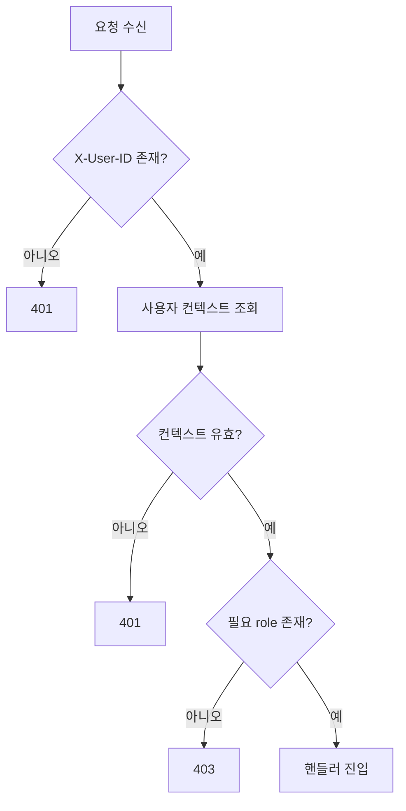

# MSA 서비스간 통신 인증 절차

## 목적

현재 운영 중인 Gateway 라우팅 + `X-User-ID` 전달 구조를 기준으로, MSA 통신 인증 규칙과 향후 JWKS 전환 계획을 함께 정리한다.

관련 용어: [Access Token](./glossary.md#access-token), [X-User-ID](./glossary.md#x-user-id), [JWKS](./glossary.md#jwks-json-web-key-set)

이 문서는 아래 두 파트로 분리된다.

- 인증 구조 이해 파트: 역할 분리와 표준 계약의 의미를 이해하는 목적
- 개발 가이드 파트: 요청/응답 계약과 검증 순서를 구현에 반영하는 목적

<a id="msa-auth-understanding"></a>
## 인증 구조 이해 파트

이 파트는 책임 경계와 검증 원칙을 이해하는 목적이며, 구현 체크리스트 상세는 다루지 않는다.

현재 운영 기준: MSA 간 표준 헤더는 `X-User-ID`이며, `Authorization` 전달/JWKS 직접 검증은 아직 표준으로 도입하지 않았다.

## 이 문서를 읽는 방법 (인증 초심자용)

- 이 문서는 "MSA API를 호출할 때 현재 어떤 컨텍스트를 전달하고 어디서 검증하는가"를 설명한다.
- 인증은 "누구인지 확인(401)"과 "권한 있는지 확인(403)"로 나뉜다.
- 서비스는 전달된 컨텍스트를 검증하고, 내부 권한 규칙 기준으로 최종 판단해야 한다.

## 표준 계약

### 필수 헤더

- `X-User-ID: <keycloak_sub>`

미도입 항목:

- `Authorization: Bearer <access_token>` (현재 MSA 간 표준 미도입)

요약:

- `X-User-ID`는 "비즈니스 로직에서 쉽게 쓰는 사용자 식별자"다.
- 현재 운영 기준에서 MSA 인증/컨텍스트의 필수 기준은 `X-User-ID`다.
- `X-User-ID = sub` 정합성 및 JWT/JWKS 직접 검증은 전환 단계에서 적용할 목표 규칙이다.

### 참고

- `X-Signature` 기반 Gateway 사용자 HMAC 인증은 현재 MSA 인증 경계에서 미사용 상태다.
- 사용자 인증 근거로 `X-User-ID` 헤더만 단독 신뢰하는 구조는 점진 개선 대상이다.

## 검증 책임 분리

### Gateway

- 라우팅/관측/헤더 전달을 담당
- Gateway 경계 인증 검증은 현재 미적용 상태

### 각 MSA

- `X-User-ID` 기반 사용자 컨텍스트 처리
- 서비스별 권한/비즈니스 규칙 검증
- JWT/JWKS 직접 검증은 현재 미적용(전환 계획 항목)

고정 원칙:

- 현행 운영은 Gateway 라우팅 + `X-User-ID` 전달 체계를 사용한다.
- 각 MSA의 JWKS 직접 검증은 도입 전까지 필수 요건이 아니다.



구현 적용이 목적이면 [개발 가이드 파트](#msa-auth-dev-guide)로 이동한다.

<a id="msa-auth-dev-guide"></a>
## 개발 가이드 파트

이 파트는 요청/응답 계약과 검증 절차 적용이 목적이며, 인증 개념의 기초 설명은 다루지 않는다.

## API 요청/응답 규약 (MSA 공통)

### 요청 헤더 규약

| 헤더 | 예시 | 필수 | 설명 |
|---|---|---|---|
| `X-User-ID` | `2f1a0d...` | O | MSA 내부 사용자 컨텍스트 식별자 |
| `Content-Type` | `application/json` | O(Body 있을 때) | JSON 요청 본문 타입 |

참고:

- `Authorization` 헤더는 현재 MSA 간 표준으로 도입되지 않았다.

### 보호 API 호출 예시

```http
POST /meal/api/v1/bookmark HTTP/1.1
Host: sandol.example.com
X-User-ID: 2f1a0d54-93e2-4ad8-b7da-6cfd0d0a1234
Content-Type: application/json

{
  "restaurant_id": 12
}
```

### 성공 응답 예시

```json
{
  "status": "ok",
  "data": {
    "restaurant_id": 12,
    "bookmarked": true
  }
}
```

### 실패 응답 예시 (권장 포맷)

401 (인증 실패):

```json
{
  "error": "X_USER_ID_MISSING",
  "message": "X-User-ID header is required"
}
```

403 (인가 실패):

```json
{
  "error": "FORBIDDEN",
  "message": "Required role is missing"
}
```

## 요청 처리 순서 (MSA 공통)

1. Gateway에서 라우팅/헤더 전달 정책 적용
2. 대상 MSA에서 `X-User-ID` 헤더 존재 확인
3. 사용자 컨텍스트 조회 및 요청 정합성 검증
4. 권한 부족 시 403, 성공 시 핸들러 진입



## 검증 포인트 상세

### 1) 헤더 존재/형식 검증

- `X-User-ID` 누락 -> 401
- `Authorization` 헤더는 현재 표준 미도입 상태다.

### 2) Gateway 경계 처리

- Gateway는 라우팅/헤더 전달을 수행
- MSA는 전달된 컨텍스트(`X-User-ID`)의 형식/존재를 검증

### 3) 사용자 컨텍스트 검증

- `X-User-ID` 형식/존재 검증
- 내부 사용자 매핑 실패 시 401

### 4) 권한 검증

- 전역 권한: `realm_access.roles`
- 서비스 권한: `resource_access[service_client_id].roles`
- 권한 부족 시 403

## 에러 코드 정책

- 401: `X-User-ID` 누락/컨텍스트 검증 실패
- 403: 인증은 성공했으나 권한 부족

## 코드베이스 정합성 메모 (현재)

- gateway route는 `X-User-ID` 전달 기준으로 정리되어 있다.
- Gateway 경계 인증 검증은 현재 미적용 상태다.
- 일부 서비스는 `X-User-ID` 기반 로직을 사용 중이다.

## 전환 체크포인트 (도입 예정)

1. Gateway 라우트에서 `X-User-ID` 전달 표준화
2. MSA 직접 JWKS 검증 도입 여부 결정
3. 도입 시 공통 JWKS 검증 모듈 적용
4. 도입 시 "유효 토큰 + 잘못된 X-User-ID" 케이스 통합 테스트 추가

## 참고 문헌

- Keycloak OIDC: https://www.keycloak.org/securing-apps/oidc-layers
- OIDC Discovery 1.0: https://openid.net/specs/openid-connect-discovery-1_0.html
- RFC 8725 (JWT BCP): https://www.rfc-editor.org/rfc/rfc8725.html
- RFC 9068 (JWT Access Token Profile): https://www.rfc-editor.org/rfc/rfc9068.html

인증 구조 원칙을 다시 보려면 [인증 구조 이해 파트](#msa-auth-understanding)로 이동한다.
