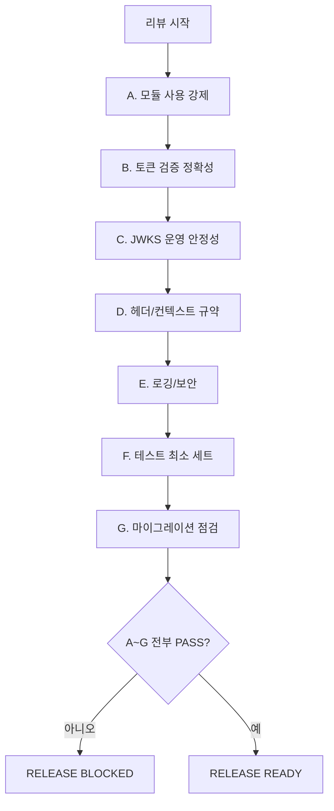

# JWKS 도입 전 검증 체크리스트 (코드리뷰/릴리즈 게이트)

이 문서는 `./jwks-common-module-guideline.md` 요구사항을 JWKS 도입 서비스에 적용할 때, PR 리뷰와 릴리즈 게이트에서 사용하는 실행 체크리스트다.

> 상태: 현재 운영 공통 체크리스트가 아니라, JWKS 전환 대상 서비스에만 적용한다.

관련 문서:

- 공통 모듈 기준: `./jwks-common-module-guideline.md`
- MSA 통신 인증 기준: `./auth-msa-communication.md`
- 용어: `docs/glossary.md`

## 사용 방법

1. PR 리뷰 단계에서 A~G 전부 점검
2. 릴리즈 직전에는 A~F를 재검증
3. 하나라도 실패하면 배포 보류

판정 기준(적용 범위):

- 본 체크리스트는 JWKS 직접 검증을 도입한 서비스에만 적용한다.
- 현행 운영(미도입 서비스)에는 적용하지 않는다.



증빙 원칙:

- "확인했습니다" 대신 코드 위치/테스트 로그/실행 스크린샷으로 증빙
- 보안 체크는 추정이 아니라 재현 가능한 결과로 확인

## A. 모듈 사용 강제

왜 필요한가:

- 서비스별로 임의 구현이 섞이면 검증 공백이 생긴다.
- 신규 개발자가 실수해도 공통 모듈이 안전장치 역할을 해야 한다.

체크 항목:

- [ ] 서비스 코드가 공통 JWKS 검증 모듈만 사용한다.
- [ ] 개별 라우터/핸들러에서 임의 decode 로직이 없다.
- [ ] 테스트 코드 외 `verify_signature=False` 사용이 없다.

실패 예시:

- 라우터에서 `jwt.decode(token, options={"verify_signature": False})`로 `sub`를 직접 꺼내 권한 판정함

## B. 토큰 검증 정확성

왜 필요한가:

- 서명만 맞아도 통과시키면 다른 서비스용 토큰(`aud`)이 재사용될 수 있다.
- `iss`/시간 클레임 누락 검증은 만료 토큰/타 발급자 토큰 허용으로 이어진다.

체크 항목:

- [ ] `iss` 정확 일치 검증
- [ ] `aud` 서비스별 검증
- [ ] `exp`/`nbf`/`iat` 검증
- [ ] 알고리즘 allowlist 검증 (`none` 금지)
- [ ] `kid` 기반 키 선택 + 미존재 시 실패

실패 예시:

- `aud` 검증이 빠져 `bot-a` 토큰으로 `meal-service` 보호 API 접근 성공

## C. JWKS 운영 안정성

왜 필요한가:

- 키 로테이션 시 캐시 전략이 없으면 정상 토큰도 실패한다.
- 반대로 실패 시 임시 허용하면 보안 사고로 직결된다.

체크 항목:

- [ ] discovery/JWKS 캐시 TTL 정책 존재
- [ ] `kid` 미존재 시 강제 refresh 1회 재시도
- [ ] 재시도 후 실패 시 401(Fail Closed)

실패 예시:

- `kid` miss 시 "일단 허용" fallback 코드가 존재

## D. 헤더/컨텍스트 규약

왜 필요한가:

- 산돌이 규칙은 `X-User-ID = sub`다. 헤더만 신뢰하면 위임/변조를 탐지할 수 없다.

체크 항목:

- [ ] MSA 경계에서 `Authorization` + `X-User-ID` 모두 요구
- [ ] 토큰 식별자(`sub`)와 `X-User-ID` 정합성 검증
- [ ] 권한 부족은 403, 인증 실패는 401로 구분

실패 예시:

- `X-User-ID`를 DB 조회 키로만 쓰고, 토큰 `sub` 비교 없이 요청 처리

## E. 로깅/보안

왜 필요한가:

- 로그는 운영에서 가장 많이 노출되는 데이터 경로다.
- 토큰 원문 노출은 곧 계정 탈취 리스크다.

체크 항목:

- [ ] 토큰 원문 로그 없음
- [ ] 오류 로그에 토큰/개인정보 마스킹 적용
- [ ] 보안 이벤트(issuer mismatch, audience mismatch, kid miss) 계측

실패 예시:

- 예외 로그에 `Authorization: Bearer eyJ...` 전체 문자열이 남음

## F. 테스트 최소 세트

왜 필요한가:

- 정상 케이스만 통과하면 배포 후 장애/보안 이슈를 막지 못한다.
- 부정 케이스를 자동화해야 회귀를 막을 수 있다.

체크 항목:

- [ ] 유효 토큰
- [ ] 만료 토큰
- [ ] 잘못된 issuer
- [ ] 잘못된 audience
- [ ] 잘못된 서명
- [ ] 알 수 없는 kid
- [ ] 헤더 누락(`Authorization`, `X-User-ID`)
- [ ] 토큰 `sub`와 `X-User-ID` 불일치

권장 추가 케이스:

- [ ] clock skew 경계값(예: +/- 120초) 테스트
- [ ] roles 부족 시 403 확인
- [ ] JWKS 강제 refresh 후 재검증 성공/실패 분기 테스트

## G. 마이그레이션 점검

왜 필요한가:

- 문서 정책과 실제 코드가 다르면 운영팀/개발팀 모두 혼란이 생긴다.

체크 항목:

- [ ] `X-User-Sub` 잔존 코드/문서 제거 또는 인증 경계 전용으로 제한
- [ ] 서비스별 공통 모듈 버전 고정 및 변경이력 기록

## 리뷰 결과 기록 템플릿

아래 템플릿을 PR 코멘트 또는 릴리즈 노트에 남긴다.

```text
[JWKS Gate Review]
- Service: <service-name>
- Reviewer: <name>
- Date: <yyyy-mm-dd>

A. Module enforcement: PASS/FAIL
Evidence: <file path / test name>

B. Token validation correctness: PASS/FAIL
Evidence: <issuer/audience/exp test logs>

C. JWKS operational stability: PASS/FAIL
Evidence: <kid miss retry log>

D. Header/context policy: PASS/FAIL
Evidence: <sub==X-User-ID test>

E. Logging/security: PASS/FAIL
Evidence: <masked log screenshot>

F. Test minimum set: PASS/FAIL
Evidence: <test report link>

G. Migration checks: PASS/FAIL
Evidence: <diff/link>

Final decision: RELEASE BLOCKED / RELEASE READY
```
